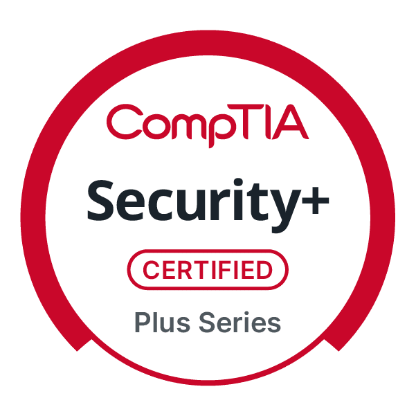
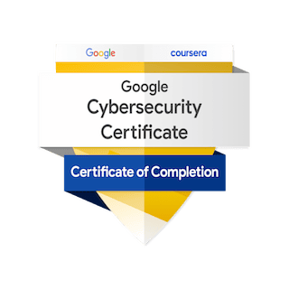
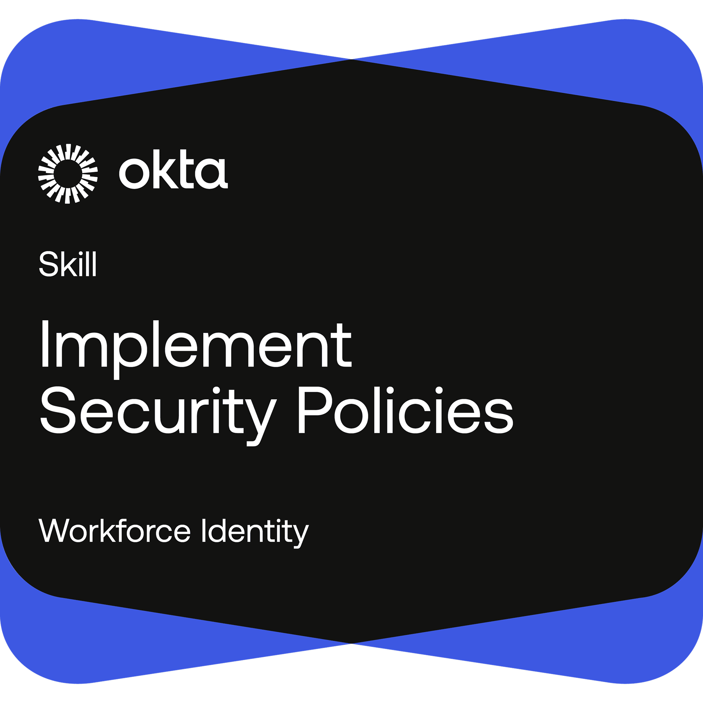
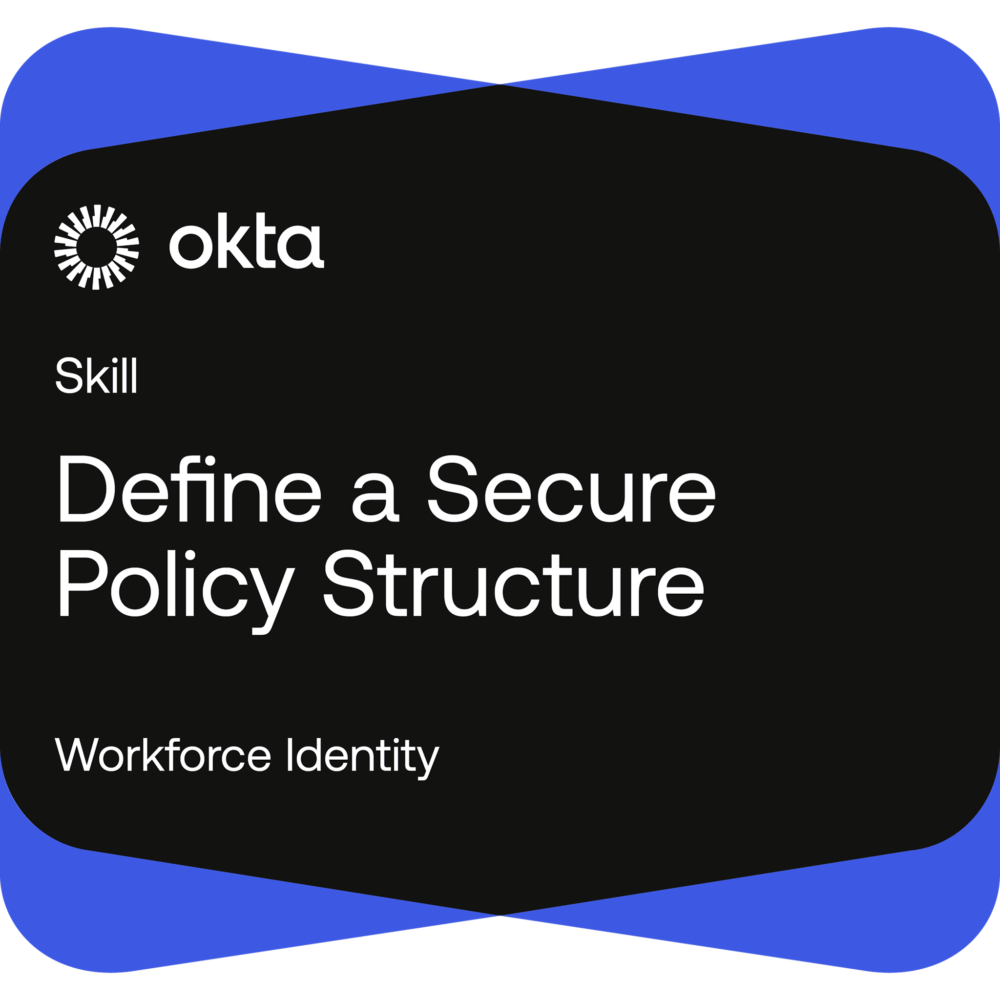
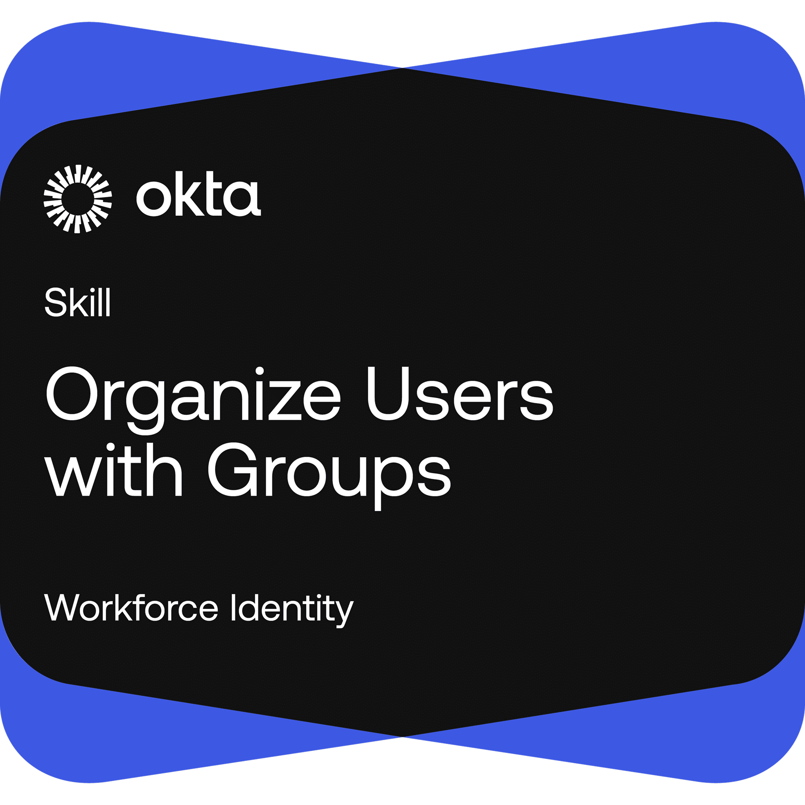
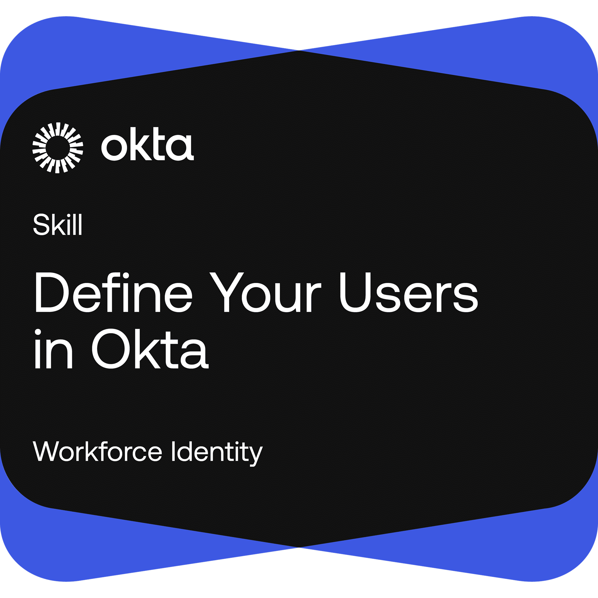
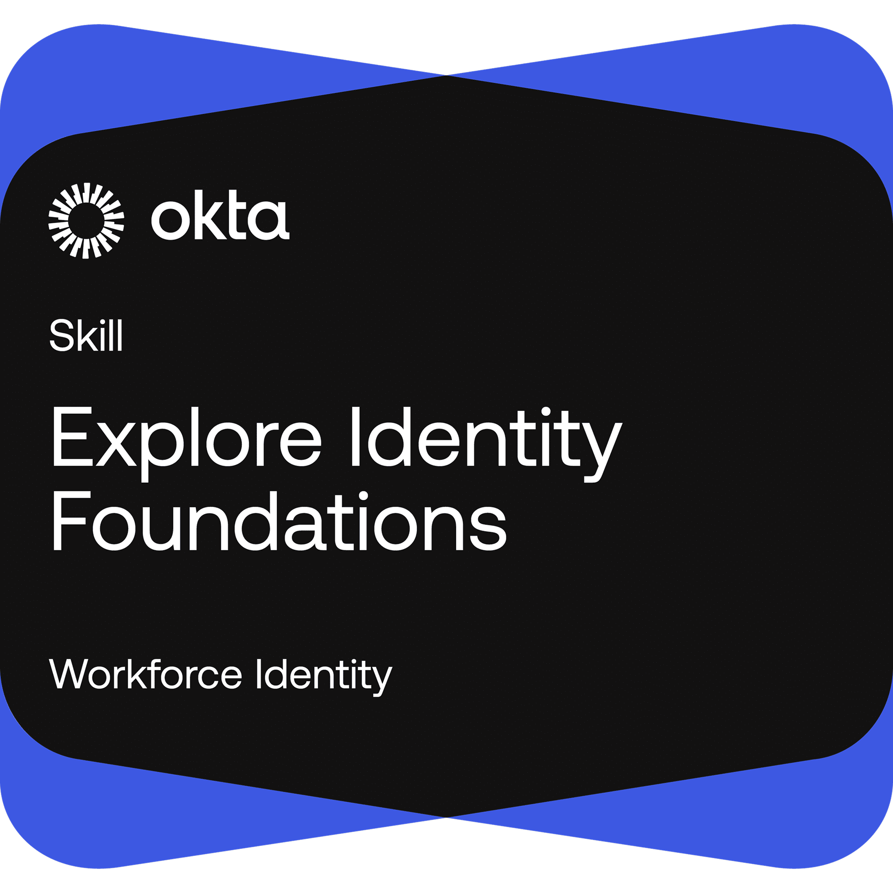
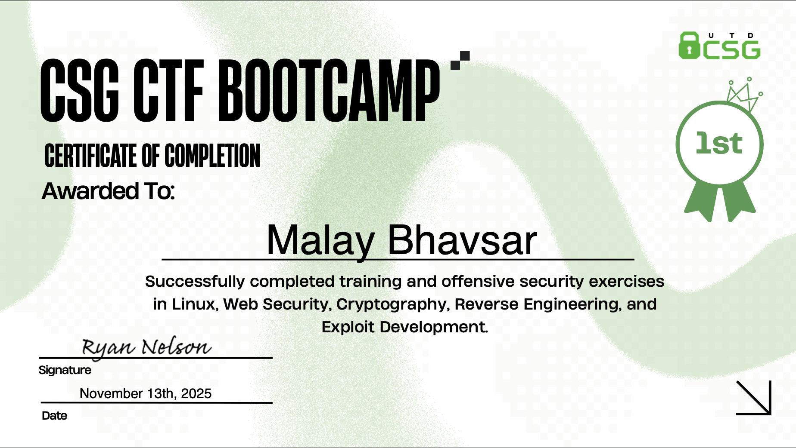

# Malay Bhavsar :wave:

## About Me

I’m **Malay Virendra Bhavsar**, a Computer Science graduate (Dec 2025) specializing in cybersecurity and embedded security testing. I currently work as an Automotive Cybersecurity Test Engineer at Toyota Tsusho Systems US Inc., assigned to Toyota Motor North America HQ in Plano, Texas. My work focuses on in-vehicle product security testing, reverse engineering, ethical hacking, and vulnerability assessment of embedded automotive systems.

  
  

## Work Experience

- **Automotive Cybersecurity Test Engineer**, Toyota Tsusho Systems US Inc., Texas USA  
   On assignment at **Toyota Motors North America HQ, Plano, Texas USA**  
   February 2026 - Present

- **Software Developer**, 3rd Digital Pvt. Ltd., Ahmedabad India  
   January 2023 - December 2023

- **Software Developer Intern**, 3rd Digital Pvt. Ltd., Ahmedabad India  
   May 2022 - July 2022

## Education

- **Graduate Certificate in Cyber Defence**, University of Texas at Dallas, USA  
   August 2025 - December 2025

- **Master of Science in Computer Science**, University of Texas at Dallas, USA  
   January 2024 - December 2025

- **Bachelor of Engineering in Information Technology**, Gujarat Technological University, India  
   June 2019 - May 2023

## Certification

- **[CompTIA Security+ SY0-701](https://www.credly.com/badges/cc5d721b-d3f2-4784-a0c8-723cae1f80ec/public_url)** - CompTIA (June 2025 - June 2028)  
  _Threat Intelligence, Risk Management, Cryptography, Secure Network Architecture, Identity and Access Management (IAM), Security Operations, Incident Response, Governance Risk and Compliance (GRC), Security Controls, Wireless & Cloud Security, Zero Trust, Disaster Recovery & Business Continuity._
- **[Google Cybersecurity Specialization](https://www.credly.com/badges/1480e6a9-03e9-4903-b08c-be58ddc9b704/public_url)** - Google (May 2025)  
  _Information Security, Intrusion Detection/Prevention System, System Information and Events Management, Security Orchestration Automation and Response, Incidence Response, TCP/IP, Vulnerability Assessment & Management. Hands-on experience with Wireshark, tcpdump & Suricata._

## Skills Badge

  
  
  
  
  

## Projects

### Java

- **[Day2Day Task Manager](https://github.com/Leo-Malay/Day2Day-Task-Manager-Spring-Boot-Application)** - _Java, SpringBoot, Sqlite, Docker_
  - Developed a Day2Day task tracker website to effectively plan out the day and keep track of all tasks.
  - Built the application using the Spring Boot framework to accelerate development and simplify backend configuration.
  - Dockerized the app and deployed it as a conternerized service to ensure consistency across execution environments.
- **[Shamir’s Secret Sharing Scheme](https://github.com/Leo-Malay/Shamirs-Secret-Sharing-Scheme-Implementation)** – _Java, Multi Party Computation_
  - Implemented cryptographic scheme to create a secure, fault-tolerant and decentralized data sharing system.
  - Effectively split secret into threshold shares which ensures no single person may have access to whole secret.
  - To regenerate original secret, it requires a thresold number of shares ensuring no single point of compromise.
- **[Rou-airol & Carvalho's Mutual Exclusion Algorithm (Distributed Systems)](https://github.com/Leo-Malay/Roucairol-and-Carvalhos-Mutual-Exclusion-Algorithm-for-Distributed-Systems)** - _Java, Sockets, Logical Clocks_
  - Solved problem of mutual exclusion for shared resource across a group of distributed systems.
  - Implement Rou-airol & Carvalho's Mutual Exclusion Algorithm to achieve resource access syncronization across systems.
  - Utilized scalar clocks, priority queue and reliable socket connections to make decision on resource allocation.
- **[Secure Remote Password Protocol SRP-6a](https://github.com/Leo-Malay/Secure-Remote-Password-Protocol-Implementation)** – _Java, Zero Knowledge Proof_
  - Implemented PAKE protocol for password less authentication over an insecure mode of communication.
  - This protocol allows for secure authentication without ever sending the password over the channel.
  - Provides protection againts passive and active eavesdropper on an insecure channel ensuring forward secrecy.
- **[Chandy Lamport Snapshot Algorithm (Distributed Systems)](https://github.com/Leo-Malay/Chandy-Lamports-Snapshot-Algorithm-for-Distributed-Systems)** - _Java, Sockets, Logical Clocks_
  - Implemented a non-intrusive algorithm for distrubited system to capture global consistent state.
  - Made use of Marker messages to keep track of states without halting the system communications.
  - Utilized FIFO queues, logical clocks, reliable socket connections and graceful process failure to handle global snapshot.

### Full Stack

- **Password Manager** – _ElectronJS, MongoDB, ExpressJS, ReactJS, NodeJS, Redux_
  - Created a desktop application for secure management of passwords, notes, and remote server settings using AES-CBC-256-bit encryption.
  - Designed an intuitive user interface for efficient access and management of protected information, emphasizing user experience and security.
  - Implemented advanced cryptographic techniques to prevent unauthorized access and ensure data integrity.
- **Study Portal** – _MongoDB, ExpressJS, ReactJS, NodeJS, Redux_
  - Developed an academic management application to help students track exams, deadlines, and notes, enhancing organizational efficiency.
  - Implemented features for managing to-do lists, keeping users organized and on top of academic responsibilities.
  - Designed a user-friendly interface to facilitate easy tracking and management of academic tasks and deadlines.
- **Job Portal** – _MongoDB, ExpressJS, ReactJS, NodeJS_
  - Designed and built a job portal tailored for university undergraduates using the MERN stack.
  - Enabled students to create profiles, filter job opportunities, and receive personalized job recommendations assesses job fit and hiring likelihood.
  - Facilitated job postings by companies, which are dynamically displayed in a feed accessible to students.

### Cybersecurity

- **Network Intrusion Detection Lab** – _Wireshark, tcpdump, Suricata_
  - Captured and analyzed network packets for anomaly detection using IDS tools.
  - Simulated DDoS and port scanning attacks and analyzed system response.

## Extra Curricular Activities

- **[CSG Capture The Flag BootCamp (Fall 2025)](https://csg.utdallas.edu/)** - _Team 2 (1st Place Winners)_
  - Completed a 10-week, semester-long CTF bootcamp with weekly workshops and hands-on challenges.
  - Gained experience in Linux, Web Security, Cryptography, Reverse Engineering, and Exploit Development.
  - Led Team-2 to a 1st place finish across all weekly challenges and final standings.

  

- **[Panelist (From Arrival to Adjustment - Life as an International Student), DFW Forum (July 2025)](https://dfwforum.wixsite.com/dfwforum)** - _Panelist_
  - Share personal experiences highlighting the challenges of being an international student in the U.S.
  - Provide insights into key academic and cultural differences between Western and Eastern education systems.
  - Engage with attendees by answering questions on how universities can better support international students and address their unique needs.
- **[Volunteer, VCF SouthWest (2025, 2024)](https://www.vcfsw.org/)** - _Registration, Tech Valet/Support, Audio/Visual Support_
  - Managed attendee check-ins and provided a welcoming experience at the registration desk.
  - Operated the Tech Valet and Support service, assisting with gear check and event flow.
  - Supported A/V setup and livestreaming under the direction of **Kevin Trinkle**, Head of Volunteers and Event Director.
- **[Student Coordinator, Qubic Coding Club (2022 - 2023)](https://adit.ac.in/club_coding.html)** – _Event Planning, Public Speaking, Peer Engagement_
  - Co-organized and led a seminar introducing students to hackathons, their structure, and real-world applications.
  - Worked under the guidance of **Prof. Jitiksha Patel** and **Prof. Nayan Mali** to coordinate event logistics and facilitate small-group discussions.
  - Presented insights on building hackathon-ready projects, improving skills, and leveraging hackathons for personal growth and professional profiles.

## Contact Me

- Email: [malaybhavsar.290@gmail.com](mailto:malaybhavsar.290@gmail.com)
- GitHub: [Leo-Malay](https://github.com/Leo-Malay)
- LinkedIn: [Malay Bhavsar](https://www.linkedin.com/in/leo-malay-bhavsar/)
